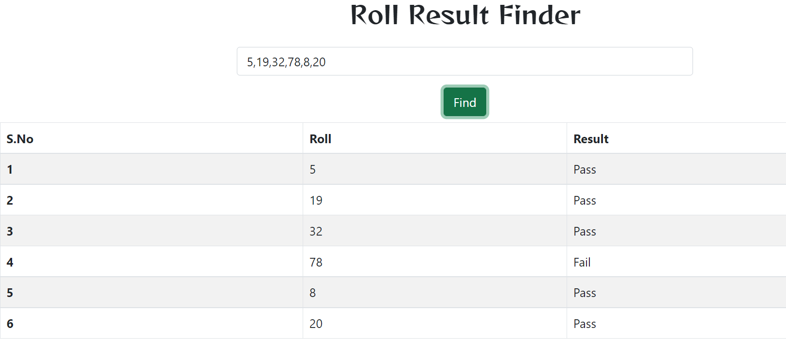
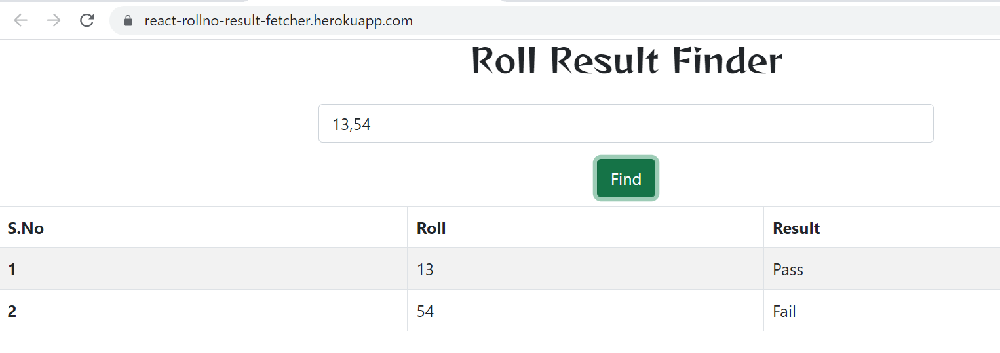
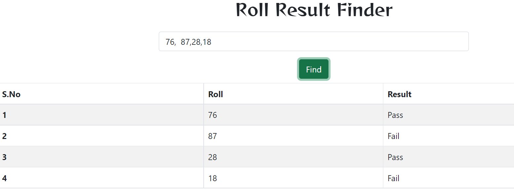
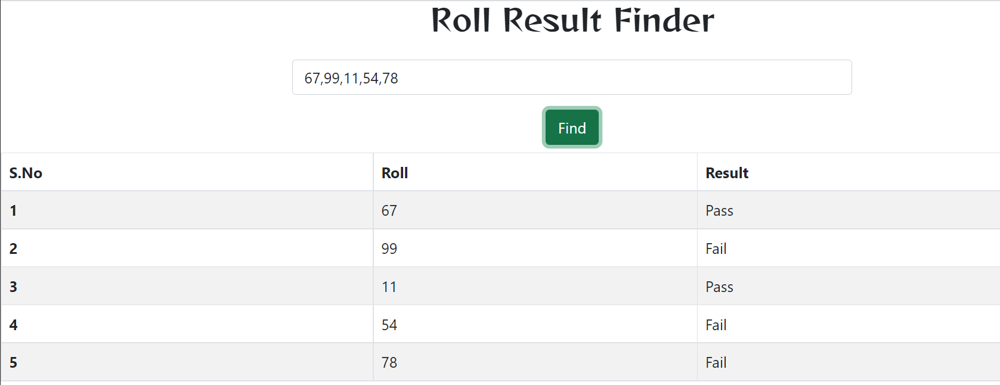

**About the Project**
This project is used to find the result of a students if he/she is passed or not!!
the user is able to give comma seprated roll numbers and can get all the data of students in a tabular format.

**See This Project Live on Heroku**
[React-Rollno-Result-Fetcher](https://react-rollno-result-fetcher.herokuapp.com/)

**Component Used**
1) App (JSX)
[Functional Component Used with React Hooks(useState).]

*This component fetch all the reslts from the api given and compute result from that api with their respective roll no and save them in array using useState hook and finally return the component Table using array.map as a tabular format*

**Library Used**
1) react
2) react-dom
3) axios
4) express

**Test Cases with Screenshots**
*Test Case 1*

**N = 5**

*Test Case 2*

**N = 9**

*Test Case 3*

**N = 16**

*Test Case 4*

**N = 156**

**ThankYou Very Much**

